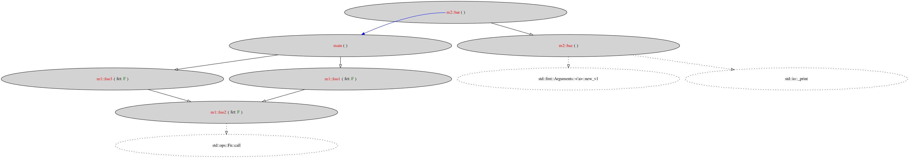

Compute the callgraph of a crate.

## Usage

First, run `cargo-callgraph`. The output is currently `target/doc/dependencies.dot` (it’s
hardcoded).

Assuming you are on linux, you can use `dot -Txlib target/doc/dependencies.dot`
to generate an image from the graphviz text file.

You can also use `dot -Tpng target/doc/dependencies.dot > some_file.png` or `dot
-Tpng:cairo target/doc/dependencies.dot > some_file.svg` if you prefer. Note
that `dot -Tsvg` has a bug the miscompute the size of the fonts, so you need to
use `-Tsvg:cairo` instead. You can the use image viewer like `eog` or even
`firefox` ot open the svg file.

Instead of using `dot`, you can also use `fdp` (it's provided alongside `dot`).
Functions will be more spread on the screen.

### Callgraph of a single file in the test directory

```sh
cargo run -- test/test1/src/main.rs && dot target/doc/dependencies.dot -Txlib
```



### Callgraph of the test project.

First you need to build (either in debug or release mode `cargo-callgraph`.

```sh
cargo build
```

Then you can move in the test repository and generate the callgraph. To do so
you need to adjust `RUSTDOC` to point to the binary you just compiled.

```sh
cd test/test1
env RUSTDOC=../../target/debug/cargo-callgraph cargo doc && dot target/doc/dependencies.dot -Txlib
```


### Callgraph of any other project

Currently, I highly advice against testing `cargo-callgraph` on any crate that
has more than 500 SLOC since the output will be very hard to visualize, and
`dot` is extremely slow with bigger graph.

Like for the test project, you will first need to compile the current crate with
`cargo build`. Then you will need to use the same nighly version that this crate
use to generate the callgraph. Fortunately, it’s easy to know which version
works, since it’s in the `rust-toolchain` file (it’s the `channel` in followed
by your target triple).

```txt
[toolchain]
channel = "nightly-2020-12-10"
components = ["rustc-dev", "llvm-tools-preview"]
```

```
cd /your/other/crate
RUSTDOC=/path/to/cargo-callgraph/target/debug/cargo-callgraph cargo doc && dot -Txlib target/dot/dependencies.dot
env RUSTDOC=/Users/robinm/perso/cargo-callgraph/target/debug/cargo-callgraph cargo doc && dot /Users/robinm/perso/cargo-callgraph/target/dot/dependencies.dot -Tpng > x.png && open x.png
```

I recommend using the `--no-deps` option, in order to limit a bit the size of
the output. `dot` (or `fdp` for that matter) is very slow with huge graphs.

## License

Since this is a fork of rustc, this project is distributed using the same
licenses.

Rust is primarily distributed under the terms of both the MIT license
and the Apache License (Version 2.0), with portions covered by various
BSD-like licenses.

See [LICENSE-APACHE](LICENSE-APACHE), [LICENSE-MIT](LICENSE-MIT), and
[COPYRIGHT](COPYRIGHT) for details.

## History of this project

When I started working on this project I had a 3 week break between two jobs,
and I used my free time to work on a static analyser that would display
information about the callgraph of a Rust project. In a perfect world I would
love to have a tool that can give a bird-eye view of your source code. This
would be especially useful when you start working on a huge codebase and you
want to understand both the general architecture or specific details that
interact with various part of the codebase. This project was my attempt to
create such tool. It was unfortunately a much bigger task that what I expected,
and I never took the time to finish it.

My idea was to compute (statically) the call graph of the whole project, then
display that callgraph. I chose to analyse Rust code, because it’s grammar make
it much more friendly for writing tools than C++ (two language that I’m very
familiar with and that I use regularly). To extract the information
from the source-code, I forked the Rust compiler, and to display the result, my
tool was generating a .dot file that can be converted to a png or svg using the
command dot (from the [graphviz](https://www.graphviz.org/) project).

Extracting the call-graph is very easy, as long as you don’t have function
pointers (both raw pointers or any kind of v-table, like when using `&dyn
Trait`), but as soon as you have those it become much more involved
because they add indirections. When I started to work on my project, I thought
that the hard part was going to correctly extract the information I need, and
it’s where I spend the most time. I choose to fork the Rust compiler as a
baseline, re-using most of the infrastructure used by rustdoc. I think I should
have based my work on rust-analyser instead, because maintaining a fork of
rustc is complicated since a lot of internal data structures changes quite
often. In retrospective, I think that rust-analyser would have been a base
easier to maintain than rustc. Because of this my project works only with some
random nightly version of rustc from 2021 but fortunately I pinned it, so
I can still compile it!

The second part of that project was to display the call graph. At first I
thought that generating a simple dot file (and using graphviz as I said earlier
to generate the svg/png) was enough. My goal was to have a proof of concept,
not a production-grade tool at the first try! I was wrong of thinking that
graphviz would be enough! The amount of information I was generating in that
text file was so huge that it took forever to generate the images even for very
small (500 LoC) project being analyzed. I also realized that adding
interactivity would have been a huge plus. For example dynamically
showing/hiding some part of the call graph. Unfortunately I ran out of time
when I realized that. I gave myself 3 weeks to have a proof of concept, but I
was far from it. After that I had a new job, so much less time and motivation.
It’s the main reason why I never finished it.

To sum-up it was a very interesting project. I learned a lot, both how a
compiler was working, how the rustc project was organized (the people I
interacted with were very lovely), and how about leading a project in general.
Most of what I’ve done was extremely exploratory, and I can feel it in the
quality of the code I wrote. You can still find most of what I’ve done in [this
file](https://github.com/robinmoussu/cargo-callgraph/blob/master/src/librustdoc/extract_dependencies.rs).


